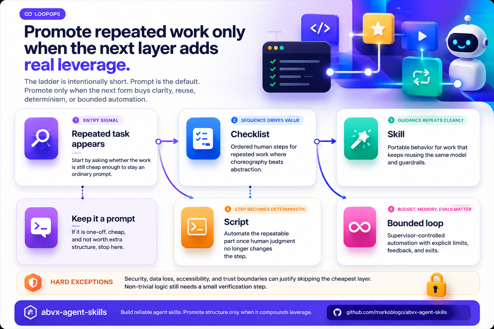

# ABVX Agent Skills

<p>
  
</p>

Small, reviewable, validation-gated agent skills for Codex-style project work.

[](https://github.com/markoblogo/abvx-agent-skills/actions/workflows/validate.yml)
[](https://github.com/markoblogo/abvx-agent-skills/actions/workflows/security-audit.yml)
[](https://pypi.org/project/abvx-agent-skills/)


ABVX Agent Skills is a small, auditable skillpack for coding agents that helps them write smaller diffs, debug from evidence, compact noisy shell output, and verify work before saying done.

These are not prompt dumps. They are compact `SKILL.md` workflows with clear triggers, attribution, risk notes, and validation. They are portable, versioned agent capabilities meant to be previewed, inspected, and loaded on demand through the Agent Skills progressive-disclosure model.

They also are not a replacement for MCP or CLI tools. In the ABVX stack, MCP is the access layer for external services, CLI is the execution layer for deterministic work, and skills are the discipline layer: they decide when to use MCP, when to use CLI, which checks are mandatory, and when a repeated workflow should become a reusable gate.

## Try One Skill In 2 Minutes

Preview before installing:

```bash
gh skill preview markoblogo/abvx-agent-skills minimal-diff-builder
```

Install one skill:

```bash
gh skill install markoblogo/abvx-agent-skills minimal-diff-builder --agent codex --scope user
```

Then ask your coding agent:

```text
Use minimal-diff-builder. Implement the smallest correct fix for this issue.
```

The newer bet in this pack is **LoopOps**: useful skills should not compete with stronger base models by restating generic advice. They should capture repo-specific context, tool adapters, verification gates, and supervisor contracts that can promote repeated work into scripts, workflows, and cost-bounded agent loops.

That makes skills an orchestration surface rather than another prompt collection: a good skill can route to an MCP server for access, call a CLI or script for heavy work, and then require proof, review, or release gates before the agent claims completion.

The pack also keeps several engineering patterns explicit rather than hidden in one monolithic command: shared domain language and ADR capture, red-green-refactor loops, architecture reports, issue slicing, and two-axis code review where one pass checks repo standards and another checks the originating spec.

## Context

This repository assumes that many public AI skills are net-negative. The bar here is not novelty or stars. The bar is whether a skill adds usable structure without degrading behavior.

Video context: [I scraped AI skills from GitHub and tested whether they actually help models](https://youtu.be/F73_ofen8rI)

## Catalog

Browse the searchable catalog at [lab.abvx.xyz/tools/abvx-agent-skills/](https://lab.abvx.xyz/tools/abvx-agent-skills/). The page is powered by the generated catalog data in [docs/catalog.json](docs/catalog.json), so the repository remains the source of truth while the published catalog lives on ABVX Lab.

If you want a scan-friendly text catalog for browsing or indexing, use [CATALOG.md](CATALOG.md).

## Start With One Job

| Job | Install | Use when |
|---|---|---|
| Write smaller patches | `minimal-diff-builder` | The agent keeps refactoring too much, widening blast radius, or adding abstractions you did not ask for. |
| Debug from evidence | `diagnose` | The agent keeps guessing fixes without reproducing the failure and verifying the result. |
| Review plans before work | `assumption-excavation`, `pipeline-readiness-gate` | A plan, SET bundle, or spec sounds plausible but may hide assumptions or missing gates. |
| Run reversible agent work | `reversible-agent-task` | A task should produce retained output first, then move through inspect -> select/apply/discard before touching the target workspace. |
| Check ship confidence | `confidence-fragility-review`, `delivery-baseline-audit` | A release, README, generated plan, or PR sounds done but evidence may be thin. |
| Save tokens in shell-heavy work | `rtk-assisted-shell`, `shell-output-compaction`, `token-efficient-execution` | Logs, diffs, tests, and command output are burning context and hiding the real signal. |
| Verify frontend work | `browser-verification`, `design-critique-polish`, `motion-review-gate` | The agent says "done" without checking real browser behavior, layout, states, motion, or console errors. |

## LoopOps

LoopOps is the framework layer in this repo: it decides when a repeated prompt should remain a prompt and when it should become a checklist, skill, script, or bounded loop.

See:

- [docs/loopops-guide.md](docs/loopops-guide.md)
- `loopops-protocol`
- `dynamic-workflow-packets`
- `skillopt-evolve-skills`

<p>
  
</p>

## Start Here

- **Need to save tokens?** Start with `rtk-assisted-shell`, `shell-output-compaction`, `token-efficient-execution`, and `lean-context-layout`. Add `compaction-survival` if your sessions run long enough to forget their own state.
- **Need to debug a repo?** Start with `diagnose`, `repo-debugging-ledger`, and `graph-guided-code-reading`.
- **Need code review discipline?** Run a Standards pass with `overengineering-review`, `minimal-diff-builder`, or `architecture-deepening-review`, then a Spec pass with `delivery-baseline-audit` against the issue, PRD, or task contract.
- **Need to surface hidden assumptions before implementation?** Start with `assumption-excavation`, then use `pipeline-readiness-gate` when the work needs a pre/post/ship sequence.
- **Need reversible agent work?** Start with `reversible-agent-task` when output should be retained and inspected before any `select`, `apply`, or `discard` decision.
- **Need to test whether confidence is earned?** Start with `confidence-fragility-review` before trusting release notes, public claims, generated plans, or SET handoff bundles.
- **Need the smallest correct implementation path?** Start with `minimal-diff-builder`, then add `delivery-preflight-gate` when the task is long or risky enough that baseline verification matters.
- **Need to cut bloat from an existing diff or repo slice?** Start with `overengineering-review`, and switch to `minimal-diff-builder` when you want the cuts implemented as the smallest correct patch.
- **Need to build frontend?** Start with `frontend-product-builder`, `designmd-brand-kit`, `browser-verification`, and `motion-review-gate` when interaction motion changes.
- **Need a small Lottie or SVG-driven motion asset?** Start with `lottie-motion-builder`, pair with `frontend-product-builder` when the animation needs to land inside a real UI surface, then run `motion-review-gate` before shipping.
- **Need a standalone HTML artifact?** Start with `html-diagram-artifact` for SVG-first architecture explainers, or `html-brief-artifact` for plans, summaries, reports, and research notes.
- **Need stronger UI taste or design setup?** Start with `design-register-bootstrap`, `frontend-taste-layer`, `design-critique-polish`, and `motion-review-gate` for motion-sensitive surfaces.
- **Need long-session continuity?** Start with `handoff`, `compaction-survival`, and `token-usage-audit`.
- **Need to onboard a new repo?** Start with `project-context-bootstrap` and follow with `durable-context-maintenance`.
- **Need to explore dense agent docs interactively?** Start with `rabbithole-doc-exploration` when Rabbithole MCP is available, or use its direct-review fallback.
- **Need one local workspace across many domains?** Start with `personal-workspace-router` to create a root router, isolated domain context, user-triggered memory, decision logs, and sparse routing corrections.
- **Need discovery or product shaping?** Start with `rapid-grilling`, `doc-grounded-grilling`, and `spec-to-prd`. Use repo glossary/context files and ADRs as first-class artifacts when domain language or consequential decisions settle.
- **Need to turn plans into execution?** Start with `plan-to-issues`, `repo-issue-triage`, and `test-driven-execution`.
- **Need to take an idea all the way to a shipped slice?** Start with `idea-to-ship-gates`, then route into `spec-to-prd`, `plan-to-issues`, `delivery-preflight-gate`, and proof/review skills only where the current gate needs depth.
- **Need to publish or monitor social content safely?** Start with `social-publishing-gate` so drafts, audits, approvals, external posting, and follow-ups stay separate.
- **Need safer long delivery runs?** Start with `delivery-preflight-gate`, `phase-spec-execution`, `recovery-loop-3strike`, and `delivery-baseline-audit`.
- **Need to gate a branch before PR publication?** Start with `delivery-preflight-gate` push-gate mode, then add external tooling such as `no-mistakes` only when the repo benefits from an isolated disposable worktree.
- **Need to route security work?** Start with `authorized-security-router` before any defensive security review where authorization, target boundary, or allowed action level is not explicit.
- **Need to evaluate document memory?** Start with `doc-to-lora-evaluator` before proposing Doc-to-LoRA, RAG replacement, or adapter-based document recall.
- **Need to launch a bounded agent loop?** Start with `goal-loop-designer` before running long Codex, Claude Code, MiMo Code, or local-LLM loops.
- **Need local model serving?** Start with `local-inference-tuning` before choosing MLX, llama.cpp, Ollama, or vLLM.
- **Need a full multi-track workflow?** Start with `dynamic-workflow-packets`.
- **Need to turn repeated prompts into loops?** Start with `loopops-protocol`, then use `skillopt-evolve-skills` to capture durable lessons.
- **Need to decide where agent learning should live?** Start with `agent-learning-layer-triage` before promoting a lesson into memory, durable docs, `SKILL.md`, a script, or an eval.
- **Need to build reusable assistant packs?** Start with `role-skill-pack-design`, `workflow-policy-layering`, `brief-first-execution`, and `private-vs-publishable-skill-audit`.

## Skills

These skills are grouped by the job they do. The token-economy layer is intentionally visible first: for many teams, the easiest win is not “a smarter prompt”, but less wasted context.

### Token Economy & Context Control

| Skill | What It Does |
|---|---|
| `rtk-assisted-shell` | Routes noisy shell workflows through RTK-style filtering. On shell-heavy tasks this can cut command-output tokens dramatically, often in the same range as RTK's reported 60-90% savings on common dev commands. |
| `shell-output-compaction` | Shrinks logs, diffs, and repo search output into counts, slices, and error-first excerpts. Usually the fastest way to turn multi-screen stdout into a small, usable artifact. |
| `graph-guided-code-reading` | Replaces broad repo reading with entrypoints, symbols, dependencies, and blast radius. On large codebases this can turn “read everything” into a much smaller focus set. |
| `token-efficient-execution` | Cuts waste from repeated reads, broad rewrites, and low-value narration. Best for long coding sessions where the loop, not the final answer, is burning the budget. |
| `token-frugal-mode` | Compresses final answers without dropping the decisive technical signal. Useful when the session is tight and you want shorter replies without caveman-style degradation. |
| `lean-context-layout` | Shrinks always-loaded agent docs into a compact startup core and pushes the rest on demand. Best for bloated `AGENTS.md`, `CLAUDE.md`, and repo runbooks. |
| `compaction-survival` | Preserves the high-value working state before long sessions collapse into compaction. Saves the turns you would otherwise spend reconstructing “what were we doing?”. |
| `token-usage-audit` | Diagnoses where the budget is really going: startup bloat, shell noise, repeated reads, oversized summaries, or compaction loss. Use this before over-optimizing the wrong layer. |

### Coding, Debugging & Architecture

| Skill | What It Does |
|---|---|
| `diagnose` | Runs a disciplined debugging loop around one reproducible signal, ranked hypotheses, and narrow verification. |
| `repo-debugging-ledger` | Keeps a checked-location ledger so debugging does not keep reopening the same code and repeating the same dead ends. |
| `complexity-optimizer` | Finds safe complexity and performance simplifications without turning the codebase into a refactor festival. |
| `minimal-diff-builder` | Builds the smallest correct implementation path using a YAGNI, stdlib-first, native-first, minimal-diff ladder with explicit safety exceptions. |
| `overengineering-review` | Reviews code specifically for needless abstractions, replaceable dependencies, dead flexibility, and wrappers over stdlib or platform behavior. |
| `architecture-deepening-review` | Reviews deeper module seams, coupling, change surfaces, and testability, not just top-level architecture slogans. Pair with `html-diagram-artifact` or `html-brief-artifact` when the output should be a browser-readable architecture report. |
| `test-driven-execution` | Builds features and fixes through one-behavior-at-a-time red-green-refactor loops instead of broad speculative implementation. |
| `system-zoom-out` | Pulls a local code area back into its wider system map so you can reason about callers, modules, boundaries, and blast radius. |
| `local-inference-tuning` | Selects and tunes local LLM engines around hardware, model fit, cache policy, KV cache, batching, and OpenAI-compatible endpoints. |
| `agents-best-practices` | Hardens agent harnesses around permissions, context shape, safety, and evaluation discipline. |
| `skillopt-evolve-skills` | Improves agent instructions and skills from real task evidence rather than from theory alone. |

### Frontend, UX & Product Surfaces

| Skill | What It Does |
|---|---|
| `design-register-bootstrap` | Establishes compact design context before implementation: `brand` vs `product` register, audience, anti-references, color strategy, and PRODUCT.md / DESIGN.md direction. |
| `frontend-taste-layer` | Adds a stronger anti-slop design layer to frontend work so outputs stop looking templated, generic, or visually under-committed. |
| `design-critique-polish` | Runs a focused critique-and-polish pass to rank frontend issues, identify ship blockers, and tighten hierarchy, typography, color, and states. |
| `frontend-product-builder` | Builds usable frontends, landing pages, pitch pages, dashboards, and prototypes with a product-first interaction model. |
| `lottie-motion-builder` | Builds small production-ready Lottie assets from SVGs, logos, loaders, and UI states with a local preview harness and output verification. |
| `motion-review-gate` | Reviews frontend motion before shipping: purpose, frequency, easing, duration, origin, interruptibility, GPU-safe properties, and reduced-motion support. |
| `designmd-brand-kit` | Turns a website or brand surface into an agent-usable design system: structure, identity, and reusable UI cues. |
| `browser-verification` | Verifies real browser rendering, responsive layout, and interaction behavior instead of trusting static code inspection. |
| `web-quality-audit` | Audits accessibility, performance, UX, privacy, and browser security as one practical web quality pass. |
| `prototype-lab` | Rapid throwaway builds for testing interaction, logic, and product direction before committing to heavier implementation. |

### HTML Artifacts & Visual Deliverables

| Skill | What It Does |
|---|---|
| `html-diagram-artifact` | Creates standalone HTML/SVG diagrams for architecture, request paths, component relationships, and system explainers with minimal prose and browser-verifiable dark mode. |
| `html-brief-artifact` | Creates standalone HTML briefs for plans, status updates, PR summaries, incident notes, and research explainers without drifting into a full frontend build. |

### Project Context & Onboarding

For design-heavy repos, pair this section with `design-register-bootstrap` from the frontend section.

| Skill | What It Does |
|---|---|
| `project-context-bootstrap` | Detects the stack, asks the right project questions, and turns a weakly documented repo into a compact, agent-usable context surface. |
| `rabbithole-doc-exploration` | Opens AGENTS.md, skill docs, SET plans, repomaps, or seed docs in an optional local Rabbithole canvas for human-selected branch questions. |
| `durable-context-maintenance` | Keeps repo-local context current after architecture, workflow, and test-flow changes so agents stop rediscovering the same facts. |
| `personal-workspace-router` | Creates a local root router with isolated domain folders, user-triggered memory, decision logs, and routing corrections for multi-project operator work. |

### Discovery, Planning & Delivery

| Skill | What It Does |
|---|---|
| `rapid-grilling` | Quickly sharpens vague ideas through one-question-at-a-time alignment before heavier planning starts. |
| `doc-grounded-grilling` | Stress-tests a plan against repo docs, ADRs, design assets, and domain language so discovery stays grounded in reality. |
| `assumption-excavation` | Surfaces hidden environment, dependency, behavioral, temporal, and success assumptions in plans, docs, skills, and SET bundles. |
| `spec-to-prd` | Turns clarified context into a durable PRD for product, client, and internal roadmap work. |
| `plan-to-issues` | Breaks PRDs and plans into thin end-to-end slices that agents or humans can actually pick up. |
| `repo-issue-triage` | Moves bugs and enhancements through a compact state machine so backlog items become actionable instead of vague. |

### Research, Knowledge & Reusable Methods

| Skill | What It Does |
|---|---|
| `evidence-ledger-research` | Keeps claims, sources, calculations, and open questions in a disciplined evidence ledger. |
| `social-publishing-gate` | Gates social posts, replies, scheduling, and monitoring through draft, audit, approval, publish, and monitor steps. |
| `loopops-protocol` | Chooses when repeated agent work should stay a prompt or be promoted into a skill, checklist, script, workflow, or cost-bounded loop. |
| `agent-learning-layer-triage` | Routes agent lessons into the right auditable layer: prompt, memory, durable docs, checklist, skill, script, eval, or rejected buffer. |
| `book-to-skill` | Converts books, papers, and long documents into reusable, progressive-disclosure agent skills. |
| `doc-to-lora-evaluator` | Evaluates whether document-to-adapter memory is worth a proof-of-concept before building a Doc-to-LoRA plugin or pipeline. |
| `goal-loop-designer` | Compiles raw agent goals into bounded loop harnesses with stop rules, rubric, judge prompt, budgets, and portable artifacts. |
| `role-skill-pack-design` | Designs compact role/workflow skill packs with base layers, difference layers, boundaries, and rollout order. |
| `workflow-policy-layering` | Separates workflow from authority, escalation, forbidden actions, and validation so assistant specs stop contradicting themselves. |
| `brief-first-execution` | Starts non-trivial work with one live brief for scope, non-goals, risks, verification, and done criteria. |
| `private-vs-publishable-skill-audit` | Audits private skill packs before publication and extracts only the reusable layer. |

### Workflow, Handoffs & Multi-Track Work

| Skill | What It Does |
|---|---|
| `dynamic-workflow-packets` | Orchestrates large coding, research, audit, harness, or client-search tracks without losing verification, budgets, integration, and risk gates. |
| `pipeline-readiness-gate` | Selects a compact pre-implementation, post-implementation, or ship gate without adopting a heavy multi-agent pipeline runtime. |
| `reversible-agent-task` | Runs risky or multi-file agent work as retained output, then requires inspect -> select/apply/discard before target workspace mutation. |
| `handoff` | Produces compact continuation briefs for long-running work, agent resumes, and human handoffs. |

### Long-Run Delivery Control

| Skill | What It Does |
|---|---|
| `idea-to-ship-gates` | Routes ideas through intent, spec, slices, architecture, proof, convergence, and release gates. |
| `delivery-preflight-gate` | Runs the minimum useful baseline checks before a long implementation loop or PR publication, so pre-existing breakage and noisy branches do not poison later verification. |
| `phase-spec-execution` | Breaks larger delivery into explicit phases with acceptance criteria, verification commands, and lightweight state updates. |
| `recovery-loop-3strike` | Bounds execution failure handling to one evidence-bearing retry, one focused fix-spec, and then an honest blocker handoff. |
| `confidence-fragility-review` | Checks whether confident claims in plans, docs, releases, or workflow contracts are backed by evidence. |
| `delivery-baseline-audit` | Re-checks declared deliverables and final verification against the starting baseline and full working tree before calling the task complete. |

### Security & Defensive Review

| Skill | What It Does |
|---|---|
| `authorized-security-router` | Routes authorized defensive security and reverse-analysis tasks by scope, target type, intent, toolchain, and blocked-action gates. |

### Structured Data & Spreadsheet Work

| Skill | What It Does |
|---|---|
| `spreadsheet-workbook-forensics` | Repairs and edits spreadsheets where workbook structure, formulas, and cell-level verification matter. |

## Install

Fastest path for most users:

```bash
pip install abvx-agent-skills
abvx-skills install
```

If PyPI is temporarily unavailable, use GitVerse's PyPI mirror for that install command only:

```bash
python -m pip install abvx-agent-skills --index-url https://pypi-mirror.gitverse.ru/simple/
```

Install with GitHub CLI agent-skills support:

```bash
gh skill install markoblogo/abvx-agent-skills minimal-diff-builder
```

Target a specific host or scope when needed:

```bash
gh skill install markoblogo/abvx-agent-skills minimal-diff-builder --agent codex --scope user
gh skill install markoblogo/abvx-agent-skills diagnose --agent cursor --scope project
```

`gh skill` is currently a GitHub CLI preview feature. Use GitHub CLI `v2.90.0+`. The command set and flags are documented in the official [`gh skill`](https://cli.github.com/manual/gh_skill) manual and the GitHub changelog announcement for [GitHub CLI agent skills](https://github.blog/changelog/2026-04-16-manage-agent-skills-with-github-cli/).

Published package pages:

- PyPI: <https://pypi.org/project/abvx-agent-skills/>
- TestPyPI: <https://test.pypi.org/project/abvx-agent-skills/>

Current distribution channels:

- PyPI: published
- TestPyPI: published
- Homebrew tap: published at <https://github.com/markoblogo/homebrew-tap>
- conda-forge: staged-recipes submission currently open at <https://github.com/conda-forge/staged-recipes/pull/33719>
- `homebrew-core`: not accepted for now under the Homebrew core notability policy; use the tap instead

Install one skill into Codex:

```bash
git clone https://github.com/markoblogo/abvx-agent-skills
cp -R abvx-agent-skills/skills/dynamic-workflow-packets ~/.codex/skills/
```

Install all skills:

```bash
git clone https://github.com/markoblogo/abvx-agent-skills
cp -R abvx-agent-skills/skills/* ~/.codex/skills/
```

Start a new agent session after installation so the skill descriptions are discovered.

Install one packaged skill into Codex:

```bash
abvx-skills install dynamic-workflow-packets
```

Install to a custom destination:

```bash
abvx-skills install --destination ./tmp-skills
```

Install via Homebrew tap:

```bash
brew tap markoblogo/tap
brew install abvx-agent-skills
```

`homebrew-core` is not the current install path for this project. The upstream submission was closed under the repository's notability policy, so the maintained Homebrew channel is the ABVX tap.

Smoke-test the published package from PyPI:

```bash
python -m venv .venv
source .venv/bin/activate
python -m pip install --upgrade pip
python -m pip install abvx-agent-skills
abvx-skills list
abvx-skills validate
```

## Safety And Auditability

Before installing a skill, inspect it:

```bash
gh skill preview markoblogo/abvx-agent-skills minimal-diff-builder
```

Validate local or packaged skills:

```bash
abvx-skills validate
gh skill publish --dry-run
```

Run the static security audit:

```bash
abvx-skills audit-security ./skills --no-llm
```

This repository is intentionally optimized for inspection before trust: compact skill files, reviewable metadata, structural validation, and a publish dry-run that catches naming and metadata drift before release.

## Onboarding Paths

- **Solo dev in Codex / Cursor / Claude Code / Gemini CLI:** use [docs/solo-dev-quickstart.md](docs/solo-dev-quickstart.md) for a short install path plus a recommended starter stack.
- **Team lead standardizing repo work:** use [docs/team-rollout-playbook.md](docs/team-rollout-playbook.md) for the minimum shared-skill rollout and repo hygiene path.

## Demos

- [docs/demos/minimal-diff-builder.md](docs/demos/minimal-diff-builder.md)
- [docs/demos/diagnose.md](docs/demos/diagnose.md)
- [docs/demos/token-economy.md](docs/demos/token-economy.md)

## Distribution

If you are listing the repo in curated skill directories, agent catalogs, or install surfaces, use [docs/outreach/submission-kit.md](docs/outreach/submission-kit.md) for positioning and [docs/outreach/targets.md](docs/outreach/targets.md) for target tracking.

For the current first-wave outreach set, use [docs/outreach/first-wave-submissions.md](docs/outreach/first-wave-submissions.md).

## Repository Profile

Each public skill includes:

- `SKILL.md` - executable agent instructions
- `SKILL_CARD.md` - intended use, attribution, risks, evaluation, and version
- `agents/openai.yaml` - Codex UI metadata

The project follows the open Agent Skills shape: `SKILL.md` plus optional `scripts/`, `references/`, and `assets/`. For Codex compatibility, top-level frontmatter is kept conservative: `name`, `description`, `license`, `metadata`, and supported fields only.

The HTML artifact skills intentionally keep their deliverables single-file and dependency-light. Use them for explainers and briefs, not as substitutes for production frontend implementation.

## Contribute

### How To Contribute Your Own Skills

Use this repo when a workflow has repeated often enough that it deserves a sharper portable behavior layer, not when you just have a long prompt.

Contribution path:

- **Submit your own skill:** draft it against [docs/abvx-skillpack-profile.md](docs/abvx-skillpack-profile.md), mirror the shape of an existing skill, and open a PR with the smallest useful slice.
- **Request a missing skill:** open a [Skill Request](https://github.com/markoblogo/abvx-agent-skills/issues/new?template=skill-request.yml) when the repeated workflow is real but the right skill does not exist yet.
- **Autopsy a broken skill:** open a [Skill Autopsy](https://github.com/markoblogo/abvx-agent-skills/issues/new?template=skill-autopsy.yml) when an internal or external skill added noise, abstractions, or fake process and should be reduced into something stronger.

Good submissions usually have:

- a narrow trigger, not a vague domain
- one clear behavior change
- explicit anti-patterns or stop conditions
- honest verification instead of broad motivational prose

Use [docs/solo-dev-quickstart.md](docs/solo-dev-quickstart.md) and [docs/team-rollout-playbook.md](docs/team-rollout-playbook.md) as examples of opinionated packaging aimed at real adoption paths rather than generic documentation.

## Validate

```bash
python scripts/validate.py
```

Or validate the packaged skills through the CLI:

```bash
abvx-skills validate
```

Run a static security audit with SkillSpector:

```bash
pip install git+https://github.com/NVIDIA/SkillSpector.git
abvx-skills audit-security ./skills --no-llm
```

Evaluate reports against the repo policy and baseline:

```bash
python scripts/evaluate_skillspector.py \
  --reports-dir artifacts/skillspector \
  --policy .abvx/skillspector-policy.yaml \
  --baseline .abvx/skillspector-baseline.json
```

Validate a local skills directory:

```bash
abvx-skills validate ~/.codex/skills
```

Structural validation and security audit are separate gates. The validator checks required files, frontmatter, directory/name alignment, TODO placeholders, cards, UI metadata, and basic secret patterns.

## Benchmarks

Benchmark scaffolding now lives under [benchmarks/](benchmarks/). It documents how to measure skill impact without publishing fake precision. Until the repo has stable reproducible runs across tasks and models, benchmark numbers should be treated as pending evidence rather than marketing copy.

## Release

Build and check the package locally:

```bash
python -m pip install --upgrade build twine
python -m build
python -m twine check dist/*
```

Publish flow:

- Run the `publish` GitHub Actions workflow with `repository=testpypi` for a dry run against TestPyPI.
- Create a GitHub release, or run the same workflow with `repository=pypi`, to publish to PyPI.
- Configure trusted publishing for both `pypi` and `testpypi` environments in the package index before the first release.
- Keep the released version aligned with `pyproject.toml` and the skill inventory documented above.

## Philosophy

- Keep always-loaded context small.
- Prefer procedural rules over vague advice.
- Make skills easy to audit in diffs.
- Attribute upstream inspiration.
- Pair useful automation with risk gates and verification.

See [docs/abvx-skillpack-profile.md](docs/abvx-skillpack-profile.md) for the repository standard.

## Attribution

Several skills are inspired by public work from the broader agent tooling ecosystem. See [ATTRIBUTION.md](ATTRIBUTION.md).

## License

MIT. See [LICENSE](LICENSE).
