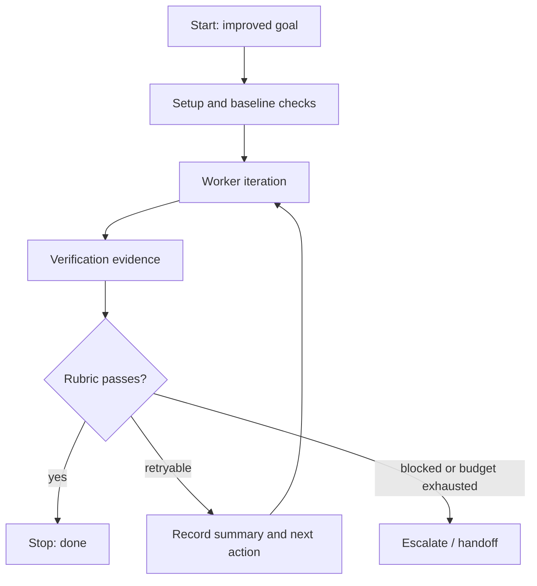

# Goal Loop Designer

Use this skill before starting a long agent loop. It turns a raw `/goal` or task prompt into a portable loop harness that another agent or model can execute and evaluate.

This skill designs the loop. It does not run autonomous tools, log in to providers, change repos, or approve edits.

## Intake

Collect or infer the smallest useful context:

- raw goal or task prompt;
- target host: Codex, Claude Code, MiMo Code, Ollama/OpenAI-compatible, or generic CLI agent;
- repo or artifact scope;
- allowed actions and forbidden actions;
- available verification commands or manual checks;
- judge options: deterministic check, human review, Codex, MiMo Auto, local Ollama, or external LLM;
- hard limits: iterations, time, token/tool budget, file scope, network, credentials, destructive actions.

If key limits are missing, choose conservative defaults and mark them as assumptions.

## Goal Critique

Before drafting the harness, critique the raw goal:

- ambiguous completion condition;
- missing non-goals;
- missing verification;
- unclear permission boundary;
- no budget or retry cap;
- self-judging without independent evidence;
- broad file or repo scope;
- hidden external dependencies;
- failure mode that would cause repeated retries.

Rewrite the goal so it is specific, bounded, and testable.

## Loop Fit

Classify the work:

- **single pass**: one execution plus verification is enough;
- **supervised workflow**: multiple ordered steps, but human approval should gate progress;
- **bounded loop**: iteration is useful and an evaluator can decide whether to continue;
- **do not loop**: the work is too risky, under-specified, or unverifiable.

Prefer the lowest level that can succeed.

If a loop produces a reusable lesson, do not automatically add it to memory or a skill. Use `agent-learning-layer-triage` after the run to decide whether the lesson belongs in a context note, durable doc, checklist, `SKILL.md`, script/tool, eval, golden fixture, or rejected buffer.

## Harness Contract

Every loop harness must define:

```text
name:
raw_goal:
improved_goal:
scope:
non_goals:
host:
worker_model:
judge:
loop_type: single_pass | supervised_workflow | bounded_loop | do_not_loop
max_iterations:
budget:
allowed_actions:
forbidden_actions:
setup:
iteration_steps:
verification:
rubric:
stop_conditions:
retry_policy:
memory_policy:
artifacts:
manual_run_commands:
```

Use deterministic verification before LLM judgment when a real check exists.

## Verification Rubric

Build a rubric with 5-9 criteria. Each criterion should have:

- name;
- pass condition;
- evidence expected;
- severity if failed: blocker, major, minor;
- evaluator: command, static inspection, browser check, human, or model judge.

The rubric should make "done" observable. Avoid vague criteria such as "good quality" unless they are decomposed into visible checks.

## Judge Prompt

If an LLM judge is useful, produce a judge prompt that:

- receives the improved goal, rubric, changed files or artifacts, and verification output;
- refuses to infer success without evidence;
- returns `pass`, `fail`, or `needs_human`;
- lists failed rubric criteria;
- recommends one next action only;
- treats missing verification as failure or human escalation.

Use a separate model when possible. MiMo Auto is a good lightweight reviewer for Codex work when network and provider access are available. Local Ollama is appropriate for private fallback only after a direct response smoke test passes.

## Budget Policy

Set explicit limits:

- max iterations, usually 1-3;
- max wall-clock time if relevant;
- max model calls if measurable;
- max changed files or directories;
- narrowest verification first;
- stop after the same blocker appears twice;
- human approval before destructive, external, credentialed, expensive, or privacy-sensitive actions.

If the user asks for a free budget, still define escalation rules and a review checkpoint.

## Portable Artifacts

Return all of these when designing a loop:

1. Improved goal.
2. Supervisor contract.
3. Verification rubric.
4. Judge prompt.
5. Budget policy.
6. Mermaid diagram.
7. YAML spec.
8. JSON spec.
9. Manual run commands for the chosen host.

Keep the artifacts copy-pasteable. Do not include secrets.

## Mermaid Shape

Use this base pattern and adapt labels:



## Output Discipline

For small requests, output a compact harness. For risky or long loops, include the full artifacts.

Final response should state:

- whether to run a loop at all;
- chosen host and judge;
- hard limits;
- exact next command or manual step;
- files or artifacts produced, if any.